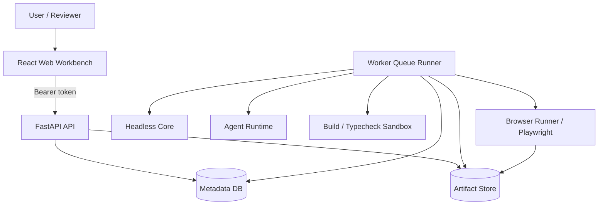

# AI JS Unpack

AI JS Unpack 是一个面向授权前端构建产物的解包、审计与可运行还原平台。

它接收 `dist` 目录、压缩包、HTML、JavaScript bundle、CSS、静态资源、source map 和 manifest，输出可审计、可解释、可构建、可浏览器验证的还原工程与证据包。项目由 React/Vite 工作台、FastAPI API、Python Worker、Headless Core、Agent Runtime、Sandbox、Browser Runner、Metadata DB 和 Artifact Store 组成。



## 核心能力

- **输入解析**：识别 HTML 入口、JS chunks、CSS、assets、source map、manifest 和资源依赖关系。
- **Headless Core**：独立执行输入规范化、文件清单、AST 索引、source map 分析、低风险重建计划和工程写出。
- **Agent 审计辅助**：以结构化 artifact 记录推断、Review/Fix、工具调用、知识命中、记忆记录、运行时诊断和报告章节。
- **验证闭环**：通过 build/typecheck、runtime smoke、runtime compare、截图、trace 和 review gate 验证还原结果。
- **证据链**：所有阶段写入 Artifact Store，保留 hash、producer、stage、attempt、parent lineage、sensitivity 和 retention 信息。
- **部署隔离**：支持 API、Worker、Browser Runner、DB、S3/MinIO Artifact Store、sandbox runner 和 Web 分离部署。

## 快速启动

安装依赖：

```powershell
npm install
python -m venv .venv
.venv\Scripts\python.exe -m pip install -r requirements.txt
```

创建本地环境文件：

```powershell
Copy-Item .example.env .env
```

推荐使用统一开发脚本启动服务。脚本会加载 `.env`，并在 Web 启动时自动生成本地 owner token：

```powershell
npm run dev:api
npm run dev:web
npm run dev:worker
```

需要把浏览器验证拆到独立服务时，再启动 Browser Runner，并让 Worker 使用它：

```powershell
npm run dev:browser-runner
node scripts/dev.mjs worker --use-browser-runner
```

默认地址：

- Web：`http://127.0.0.1:5173`
- API：`http://127.0.0.1:8000`
- Browser Runner：`http://127.0.0.1:8001`

更完整的本地启动、token、环境变量和健康检查说明见 [本地启动与验证](docs/local-startup.md)。

## 验证命令

常用基础验证：

```powershell
npm run check
npm run test:core
npm run build:web
.venv\Scripts\python.exe -m compileall apps packages tests deploy
.venv\Scripts\python.exe -m unittest discover -s tests
```

也可以运行脚本封装的轻量检查：

```powershell
npm run dev:check
```

## Core CLI

Headless Core 可以不依赖 API 或 Web 独立运行：

```powershell
npm run build
node packages/core/dist/cli.js analyze <inputPath> --job-id <jobId>
node packages/core/dist/cli.js reconstruct <inputPath> --job-id <jobId> --output-dir <dir>
```

`reconstruct` 支持目录、`.zip`、`.tar`、`.tar.gz` 和 `.tgz` 输入，并对压缩包路径穿越、绝对路径、Windows drive/UNC 路径、zip symlink、tar link 和不支持的成员类型做安全检查。

## 文档导航

| 文档 | 内容 |
| --- | --- |
| [本地启动与验证](docs/local-startup.md) | `.env`、开发脚本、token、服务启动、健康检查 |
| [开发指南](docs/development.md) | 仓库结构、开发流程、验证矩阵、调试建议 |
| [架构设计](docs/architecture.md) | 服务边界、Worker pipeline、Agent Runtime、Artifact lineage |
| [API 规范](docs/api.md) | 认证、Job、Artifact、Report、Ops、Browser Runner 接口 |
| [部署指南](docs/deployment.md) | Docker Compose、环境变量、release gate、归档、回滚 |
| [贡献指南](docs/contributing.md) | 协作流程、Lore commit、测试清单、安全边界 |

## 当前状态

仓库已经具备端到端工程骨架：共享契约、Core 分析/重建、FastAPI API、Worker 队列、Agent evidence、build/typecheck validation、runtime smoke/compare、review/fix 收敛、报告打包、远程 Browser Runner、Artifact Store 抽象、部署 profile 校验、Ops heartbeat、Prometheus 和告警事件。

生产化前请按目标环境补齐不可变镜像、生产凭证、沙箱运行时、容量基线、告警规则、端到端 smoke/soak 验收和外部证据归档。

## 授权与合规

本项目只面向自有代码、授权代码、合规安全审计、软件资产恢复、研究和内部治理场景。请勿用于绕过授权、窃取源码、规避访问控制、提取秘密或复制第三方商业逻辑。
