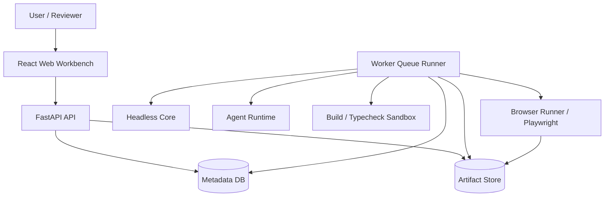

# AI JS Unpack

AI JS Unpack 是一个 AI/Agent 辅助的 JavaScript 构建产物解包、审计与可运行还原平台。

它面向授权范围内的前端构建产物分析场景，接收 `dist` 目录、压缩包、HTML、JavaScript bundle、CSS、静态资源、source map 和 manifest，输出可审计、可解释、可构建、可浏览器验证的还原工程与证据包。



## 核心特性

- **构建产物解析**：识别 HTML 入口、JS chunks、CSS、assets、source map、manifest 和资源依赖关系。
- **Headless Core**：独立执行输入清单、AST 索引、Source Map 分析、低风险确定性转换和工程写出。
- **Agent 审计辅助**：生成推断记录、Review/Fix 证据、工具调用、知识命中、记忆记录和报告章节。
- **可运行验证**：通过 build/typecheck、runtime smoke、runtime compare 和截图/trace 证据验证还原结果。
- **Artifact 证据链**：所有阶段写入 Artifact Store，保留 hash、producer、stage、attempt 和 parent lineage。
- **部署隔离**：支持 API、Worker、Browser Runner、DB、S3/MinIO Artifact Store、sandbox runner 分离部署。

## 快速启动

```powershell
npm install
python -m venv .venv
.venv\Scripts\python.exe -m pip install -r requirements.txt
```

运行基础验证：

```powershell
npm run check
npm run test:core
.venv\Scripts\python.exe -m unittest discover -s tests
```

启动本地 API：

```powershell
$env:AI_JSUNPACK_SERVICE_ROLE = "api"
$env:AI_JSUNPACK_AUTH_SECRET = "dev-secret"
.venv\Scripts\python.exe -m uvicorn apps.api.app.main:app --reload --host 127.0.0.1 --port 8000
```

启动 Web 工作台：

```powershell
$env:VITE_API_BASE_URL = "http://127.0.0.1:8000"
$env:VITE_API_USER_ID = "local-user"
$env:VITE_API_PROJECT_ID = "default"
npm run dev:web
```

启动 Worker：

```powershell
$env:AI_JSUNPACK_SERVICE_ROLE = "worker"
$env:AI_JSUNPACK_AUTH_SECRET = "dev-secret"
.venv\Scripts\python.exe -m apps.worker.worker.queue
```

更多本地 token、Browser Runner 和调试细节见 [开发指南](docs/development.md)。

## Core CLI

Headless Core 可以不依赖 API 或 Web 独立运行：

```powershell
npm run build
node packages/core/dist/cli.js analyze <inputPath> --job-id <jobId>
node packages/core/dist/cli.js reconstruct <inputPath> --job-id <jobId> --output-dir <dir>
```

支持目录、`.zip`、`.tar`、`.tar.gz` 和 `.tgz` 输入。

## 文档导航

| 文档 | 内容 |
| --- | --- |
| [开发指南](docs/development.md) | 环境搭建、本地调试、Token、常用命令 |
| [架构设计](docs/architecture.md) | 模块职责、流水线、Artifact 证据链、Mermaid 图 |
| [API 规范](docs/api.md) | 认证、Job、Artifact、Report、Ops、Browser Runner 接口 |
| [部署指南](docs/deployment.md) | Docker Compose、服务边界、环境变量、CI/CD 建议 |
| [贡献指南](docs/contributing.md) | 协作流程、提交规范、测试清单、安全边界 |

## 当前状态

仓库已经具备端到端工程骨架：共享契约、Core 分析/重建、FastAPI API、Worker 队列、Agent evidence、build/typecheck validation、runtime smoke/compare、报告打包、远程 Browser Runner、Artifact Store 抽象、部署 profile 校验、Ops heartbeat、Prometheus 和告警事件。

生产化前请按目标环境补齐镜像构建、生产凭证、沙箱运行时、容量基线、告警规则和端到端 smoke/soak 验收。

## 授权与合规

本项目只面向自有代码、授权代码、合规安全审计、软件资产恢复、研究和内部治理场景。请勿用于绕过授权、窃取源码、规避访问控制、提取秘密或复制第三方商业逻辑。
