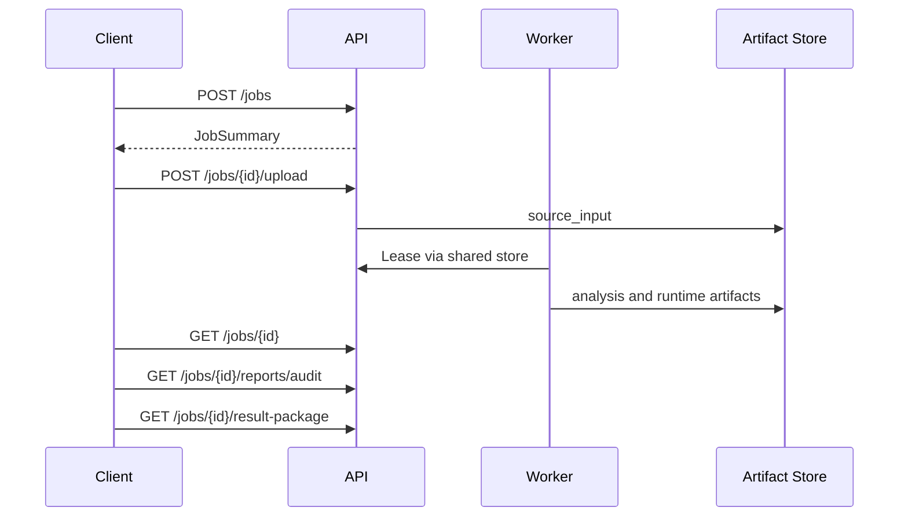

# API 规范

本文档概述当前 FastAPI 服务和 Browser Runner 服务公开的主要接口。接口以当前源码为准，不单独生成 OpenAPI 静态文件。

## 认证

API 使用 HMAC-SHA256 Bearer token。Token 由 `apps.api.app.auth.create_auth_token` 生成，服务端通过 `AI_JSUNPACK_AUTH_SECRET` 验证。

Token 类型：

- `user`：面向 Web 用户，依赖 `projects` 中的项目角色授权。
- `service`：面向 Worker 和 Browser Runner 调用，需要 `serviceRoles` 包含 `worker`。

项目角色：

- `viewer`：读取 Job、Artifact、报告和审计记录。
- `maintainer`：创建、上传、rerun、cancel、retention cleanup。
- `owner`：最高项目角色。

请求头：

```http
Authorization: Bearer <token>
```

## Job 与 Artifact 接口

| Method | Path | 说明 |
| --- | --- | --- |
| `GET` | `/health` | API 健康检查和部署 profile |
| `POST` | `/jobs` | 创建 Job |
| `POST` | `/jobs/{job_id}/upload` | 上传 source input 文件 |
| `GET` | `/jobs/{job_id}` | 查询 Job 和 Artifact 列表 |
| `GET` | `/jobs/{job_id}/artifacts/{artifact_id}/download` | 下载单个文件 Artifact |
| `POST` | `/jobs/{job_id}/rerun` | 基于原始 source input 创建新 Job |
| `POST` | `/jobs/{job_id}/cancel` | 取消非终态 Job |
| `POST` | `/jobs/{job_id}/retention/cleanup` | 执行或 dry-run 保留策略清理 |

创建 Job 请求使用共享契约中的 `projectId`、`ownerId`、`cloudMode` 和 `config`。上传成功后，API 写入 `source_input` artifact，并将 Job 推进到 `intake`。

## 报告与审计接口

| Method | Path | 说明 |
| --- | --- | --- |
| `GET` | `/jobs/{job_id}/runtime-validations` | 列出 runtime validation |
| `GET` | `/jobs/{job_id}/runtime-validations/latest` | 获取最新 runtime validation |
| `GET` | `/jobs/{job_id}/inference-records` | 列出 Agent 推断记录 |
| `GET` | `/jobs/{job_id}/review-runs` | 列出 ReviewRun |
| `GET` | `/jobs/{job_id}/tool-calls` | 列出工具调用 |
| `GET` | `/jobs/{job_id}/tool-registry` | 列出工具注册表 |
| `GET` | `/jobs/{job_id}/memory-records` | 列出 memory record，可按 memory type 过滤 |
| `GET` | `/jobs/{job_id}/audit-records` | 聚合 inference、review、tool 审计记录 |
| `GET` | `/jobs/{job_id}/reports` | 列出 report artifacts |
| `GET` | `/jobs/{job_id}/reports/audit` | 下载最新 Markdown 审计报告 |
| `GET` | `/jobs/{job_id}/reports/{report_kind}` | 下载 `audit_report`、`html_report` 或 `evidence_index` |
| `GET` | `/jobs/{job_id}/result-package` | 下载最新结果包 |

`html_report` 作为下载产物提供，不建议在 Web 工作台内直接渲染。

## Ops 接口

| Method | Path | 说明 |
| --- | --- | --- |
| `POST` | `/ops/heartbeats` | Worker/Browser Runner 写入 heartbeat |
| `GET` | `/ops/heartbeats` | 查询服务 heartbeat |
| `GET` | `/ops/metrics` | 获取聚合运维快照 |
| `GET` | `/ops/prometheus` | Prometheus text exposition |
| `GET` | `/ops/alerts` | 计算并记录告警事件，可投递 webhook |
| `GET` | `/ops/alert-events` | 查询历史告警事件 |

Ops 读接口要求 worker service token，或拥有任意项目 `maintainer`/`owner` 角色的 user token。

## Browser Runner 接口

Browser Runner 是独立 FastAPI 应用：`apps.browser_runner.app.main:app`。

| Method | Path | 说明 |
| --- | --- | --- |
| `GET` | `/health` | 队列健康、容量、lease recovery 和告警 |
| `POST` | `/browser-runs` | 提交远程浏览器运行请求 |
| `GET` | `/browser-runs/{run_id}` | 查询 Browser Run 状态和结果 |
| `GET` | `/browser-runs/metrics` | 查询队列指标 |

Browser Runner 只接受带 `serviceRoles=["worker"]` 的 service token。它不执行 Worker 的 build/typecheck 命令，只负责浏览器 runtime smoke/compare capture。

## 典型调用流程



## 错误与状态

常见失败分类包括 `invalid_input`、`parse_error`、`agent_failed`、`dependency_missing`、`install_failed`、`type_error`、`build_error`、`runtime_error`、`sandbox_denied`、`policy_denied`、`timeout`、`resource_limit` 和 `unknown`。

终态 Job 包括 `completed`、`completed_best_effort`、`failed` 和 `cancelled`。
