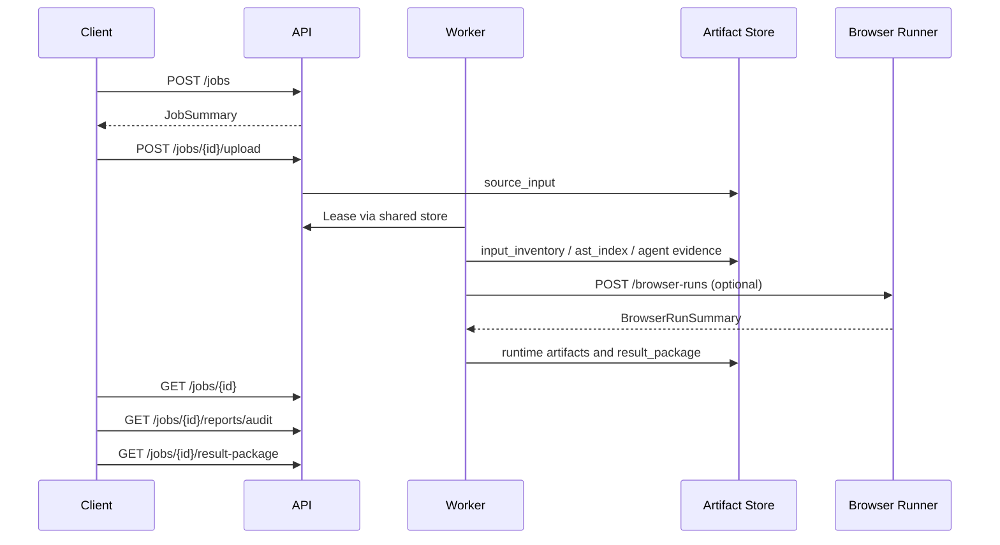

# API 规范

本文档概述当前 FastAPI 服务和 Browser Runner 服务公开的主要接口。接口以源码为准：API app 为 `apps.api.app.main:app`，Browser Runner app 为 `apps.browser_runner.app.main:app`。

## 认证

API 使用 HMAC-SHA256 Bearer token。Token 由 `apps.api.app.auth.create_auth_token` 生成，服务端通过 `AI_JSUNPACK_AUTH_SECRET` 验证。

请求头：

```http
Authorization: Bearer <token>
```

Token kind：

- `user`：面向 Web 用户，依赖 `projects` claim 中的项目角色授权。
- `service`：面向 Worker 和 Browser Runner 调用，调用受限接口时需要 `serviceRoles` 包含 `worker`。

项目角色：

- `viewer`：读取 Job、Artifact、报告和审计记录。
- `maintainer`：创建、上传、rerun、cancel 和 retention cleanup。
- `owner`：最高项目角色。

Ops 读取接口允许 worker service token，或任意项目中拥有 `maintainer`/`owner` 的 user token。Ops heartbeat 写入要求 worker service token。

## Job 与 Artifact

| Method | Path | 权限 | 说明 |
| --- | --- | --- | --- |
| `GET` | `/health` | 无 | API 健康检查和部署 profile 摘要 |
| `POST` | `/jobs` | 项目 `maintainer` | 创建 Job |
| `POST` | `/jobs/{job_id}/upload` | 项目 `maintainer` | 上传 source input 文件 |
| `GET` | `/jobs/{job_id}` | 项目 `viewer` | 查询 Job 和 Artifact 列表 |
| `GET` | `/jobs/{job_id}/artifacts/{artifact_id}/download` | 项目 `viewer` | 下载单个文件 Artifact |
| `POST` | `/jobs/{job_id}/rerun` | 项目 `maintainer` | 基于原始 `source_input` 创建新 Job |
| `POST` | `/jobs/{job_id}/cancel` | 项目 `maintainer` | 取消非终态 Job |
| `POST` | `/jobs/{job_id}/retention/cleanup` | 项目 `maintainer` | 执行或 dry-run 保留策略清理 |

创建 Job 使用共享契约中的 `projectId`、`ownerId`、`cloudMode` 和 `config`。上传成功后，API 写入 `source_input` artifact，并把 Job 推进到 `intake`。

## 报告与审计

| Method | Path | 返回 |
| --- | --- | --- |
| `GET` | `/jobs/{job_id}/runtime-validations` | `RuntimeValidationRun[]` |
| `GET` | `/jobs/{job_id}/runtime-validations/latest` | 最新 `RuntimeValidationRun` |
| `GET` | `/jobs/{job_id}/inference-records` | `InferenceRecord[]` |
| `GET` | `/jobs/{job_id}/review-runs` | `ReviewRun[]` |
| `GET` | `/jobs/{job_id}/tool-calls` | `ToolCall[]` |
| `GET` | `/jobs/{job_id}/tool-registry` | `ToolRegistryEntry[]` |
| `GET` | `/jobs/{job_id}/memory-records` | `MemoryRecord[]`，可按 `memory_type` 过滤 |
| `GET` | `/jobs/{job_id}/audit-records` | 聚合的 inference、review、tool、memory 和 runtime diagnosis |
| `GET` | `/jobs/{job_id}/reports` | 报告类 `ArtifactRecord[]` |
| `GET` | `/jobs/{job_id}/reports/audit` | 最新 Markdown 审计报告 |
| `GET` | `/jobs/{job_id}/reports/{report_kind}` | 最新 `audit_report`、`html_report` 或 `evidence_index` |
| `GET` | `/jobs/{job_id}/result-package` | 最新结果包 |

`html_report` 作为下载产物提供，不建议在 Web 工作台内直接渲染。

`report_kind` 会规范化并限制为报告 artifact 类型；未知类型返回 404。

## Ops

| Method | Path | 权限 | 说明 |
| --- | --- | --- | --- |
| `POST` | `/ops/heartbeats` | worker service | Worker/Browser Runner 写入 heartbeat |
| `GET` | `/ops/heartbeats` | ops read | 查询服务 heartbeat |
| `GET` | `/ops/metrics` | ops read | 获取聚合运维快照 |
| `GET` | `/ops/prometheus` | ops read | Prometheus text exposition |
| `GET` | `/ops/alerts` | ops read | 计算并记录告警事件，可投递 webhook |
| `GET` | `/ops/alert-events` | ops read | 查询历史告警事件 |

Ops metrics 聚合 Job 状态、活跃/过期 heartbeat、服务维度 heartbeat、Browser Runner 队列指标和 alert 状态。Webhook 由 `AI_JSUNPACK_ALERT_WEBHOOK_URL` 配置，超时由 `AI_JSUNPACK_ALERT_WEBHOOK_TIMEOUT_SECONDS` 控制。

## Browser Runner

Browser Runner 是独立 FastAPI 应用：`apps.browser_runner.app.main:app`。除 `/health` 外，接口要求 `serviceRoles=["worker"]` 的 service token。

| Method | Path | 说明 |
| --- | --- | --- |
| `GET` | `/health` | 队列健康、容量、lease recovery、alerts 和部署 profile |
| `POST` | `/browser-runs` | 提交远程浏览器运行请求 |
| `GET` | `/browser-runs/metrics` | 查询队列指标 |
| `GET` | `/browser-runs/{run_id}` | 查询 Browser Run 状态和结果 |

Browser Runner 只负责浏览器 runtime smoke/compare capture，不执行 Worker 的 build/typecheck 命令。Worker 通过 signed service token 提交异步 run，轮询结果，并把 trace/screenshot/comparison artifact 写回主 Artifact Store。

## 典型调用流程



## 错误与状态

常见 failure class：

- `invalid_input`
- `parse_error`
- `agent_failed`
- `dependency_missing`
- `install_failed`
- `type_error`
- `build_error`
- `runtime_error`
- `sandbox_denied`
- `policy_denied`
- `timeout`
- `resource_limit`
- `unknown`

终态 Job：

- `completed`
- `completed_best_effort`
- `failed`
- `cancelled`

Browser Run 终态：

- `pass`
- `fail`
- `best_effort`
