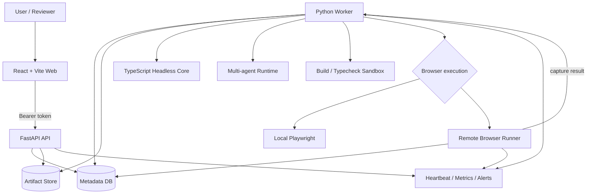
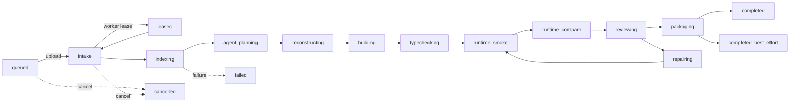
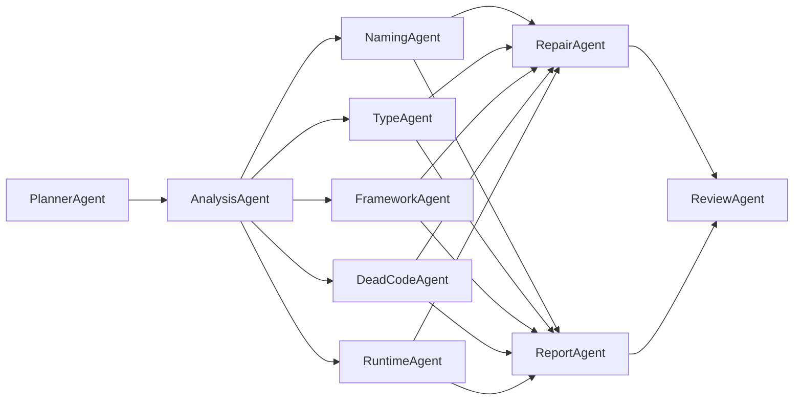
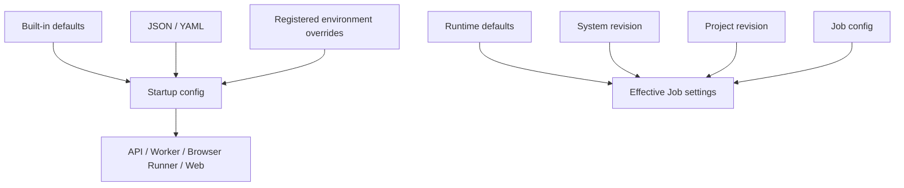
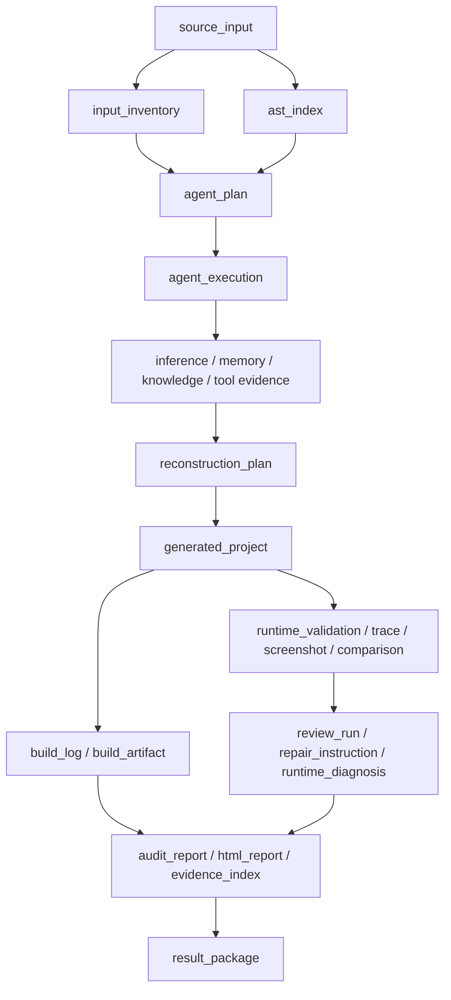

# 架构设计

AI JS Unpack 把输入解析、模型推断、工程写出、构建验证、浏览器对比和报告打包拆成可审计的边界。确定性代码拥有最终写入权；Agent 只产生结构化推断、诊断、修复建议和报告证据。

## 系统拓扑

共享基础设施可以使用本地 SQLite/文件系统，也可以使用 PostgreSQL 与 S3/MinIO。Worker 将 Browser Runner 返回的 capture 结果注册到主 Artifact Store。生产环境必须把 HTTP、Worker 执行、浏览器执行和 secret 注入分离。

## 代码边界

### 应用

- `apps/web`：官网、工作台和设置中心。负责创建 Job、上传输入、展示 Artifact、Agent evidence、运行时结果和报告。
- `apps/api`：认证、Job/Artifact 元数据、设置 revision、报告下载、retention 和 Ops 接口。
- `apps/worker`：队列租约、Core、Agent DAG、重建、sandbox、runtime compare、review/fix 和 packaging。
- `apps/browser_runner`：独立 Playwright capture 服务，提供持久队列、lease recovery、指标和远程执行边界。

### 共享包

- `packages/shared`：TypeScript 契约、状态、Artifact 类型和跨语言 schema 的事实源。
- `packages/core`：输入规范化、文件清单、HTML 引用、AST/source map 分析、重建计划和可构建工程写出。
- `packages/configuration`：JSON/YAML 启动配置、环境覆盖、运行时设置模型、脱敏与 fingerprint。
- `packages/sandbox`：local、container、gVisor、Firecracker 和远程浏览器执行策略。
- `packages/memory`：任务内、项目级、实体和场景记忆证据。
- `packages/knowledge`：框架、运行时、混淆模式和历史修复的确定性检索。
- `packages/audit`：审计概念、回滚映射、报告与 lineage 的包级边界。
- `packages/deployment`：服务角色和部署配置校验，阻止 API 携带 Worker 执行权限。
- `deploy/`：Compose、镜像、smoke、release gate、归档校验和 Firecracker launcher 模板。

## Job 生命周期

公开状态枚举由 `packages/shared/src/index.ts` 定义。当前实际上传与 Worker 路径为：

`planning`、`parsing`、`analyzing` 和 `agent_pass` 仍保留在公开状态/事件契约中，但当前 Worker 没有为它们调用 `store.update_status`；其中 `agent_pass` 只写入当前 `PipelineRun` 事件。不能把这些值描述为当前可观察的持久 Job 状态。`repairing` 只在 review/fix 循环中出现。取消请求可以发生在任意非终态，Worker 会在阶段边界收敛到 `cancelled`。

端到端流程：

1. API 创建 Job，上传文件并写入 `source_input`。
2. Worker 获取租约，调用 Core 建立 `input_inventory` 和 `ast_index`。
3. Agent Runtime 从确定性摘要、memory、knowledge 和 Artifact refs 构建多阶段 DAG。
4. Core 根据分析与受限修复建议生成 `reconstruction_plan` 和 `generated_project`。
5. Sandbox 运行依赖、build 和 typecheck 计划，并写出日志与资源策略。
6. Playwright 对原始与还原目标执行 smoke/compare，记录 DOM、console、network、screenshot 和差异。
7. Review/fix gate 在预算内应用允许的低风险动作；不可修复问题进入 best-effort 证据。
8. Packaging 生成审计报告、证据索引和结果包。

## 多智能体 DAG

Agent Runtime 使用固定阶段与显式依赖：

执行规则：

- `planner`、`analysis`、`synthesis`、`review` 串行。
- 5 个 specialist 标记为可并行，并由本地 `ThreadPoolExecutor` 执行。
- DAG 在执行前拒绝重复名称、缺失依赖、同阶段/后置依赖和依赖环。
- 上游失败时，下游节点标记为 `skipped` 并继承失败分类。
- specialist 对相同 inference type 的输出会形成 conflict record，由 ReviewAgent 合并。
- 每个 Agent 只返回约束 schema；不能直接修改生成工程。

当前 Settings 模型包含 `agents.maxParallel` 和 `agents.contextBudget`，但执行管理器尚未使用这些字段限制线程数或上下文。当前 specialist 并行度由 DAG 中可并行节点数量决定。详情见 [配置指南](configuration.md#当前执行边界)。

## 输入与 Headless Core

Core CLI 支持：

- 目录。
- 单个 `.js`、`.mjs`、`.cjs`；Core 会创建临时 `index.html` 承载脚本。
- `.zip`、`.tar`、`.tar.gz`、`.tgz`。

归档解压限制：

- 最多 10,000 个成员。
- 单文件解压后最多 64 MiB。
- 总解压数据最多 256 MiB。
- 单成员压缩比最多 200:1。
- 拒绝绝对路径、路径穿越、Windows drive/UNC 路径、zip symlink、tar link 和未知成员类型。

Core 的输出是审计与重建壳，不承诺还原原始作者源码。生成工程保留复制文件、模块候选、运行时 shim、重建 manifest 和 rollback map，供后续构建与人工评审。

## 配置与设置边界

启动配置决定服务监听、部署 profile、sandbox/provider 基线等进程级设置。运行时设置由 API 版本化保存，并在创建 Job 时合并。secret ref 只是外部标识符，实际 secret 仍由环境或部署平台注入。

API settings 的存储/合并能力与 Worker 对字段的实际消费是不同边界；文档和 UI 不应把“保存成功”描述为所有执行开关已经生效。

## Artifact Lineage

Artifact 记录至少包含 `kind`、`stage`、`attempt`、`schemaVersion`、`contentType`、hash、storage URI、producer、父 Artifact、敏感级别、保留级别和时间信息。每次 retry/repair 产生新 attempt，不覆盖旧证据。

## 浏览器执行边界

本地开发可使用 Worker 内的 Playwright adapter。配置远程 Browser Runner 后，Worker 提交受控 source archive，Browser Runner 异步 capture 并返回结果。

队列后端：

- `sqlite`：单实例本地运行。
- `postgresql`：多实例部署，推荐与 Metadata DB 共用 PostgreSQL。

生产 profile 禁止本地 Playwright fallback；没有可用远程 runner 时返回 `policy_denied`，而不是降级执行。

## 安全不变量

- API strict role 不得加载 Worker、sandbox、Browser Runner、Core CLI 或模型 provider 凭据。
- Agent 输出必须经过 schema、证据引用和 deterministic gate。
- 高隔离 sandbox 配置失败时 fail closed。
- 默认浏览器/沙箱网络策略为拒绝，放开网络必须显式配置和审计。
- Ops 指标要求认证，因为包含实例、队列、Job 与告警信息。
- `completed_best_effort` 必须携带失败分类、限制和可下载证据，不能伪装成完全成功。
