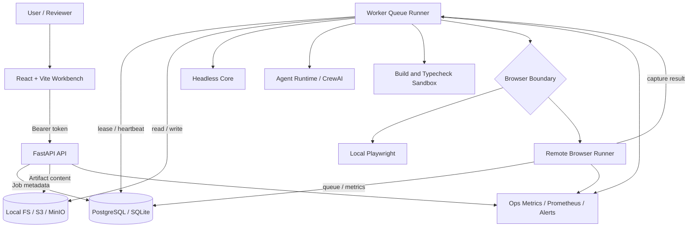
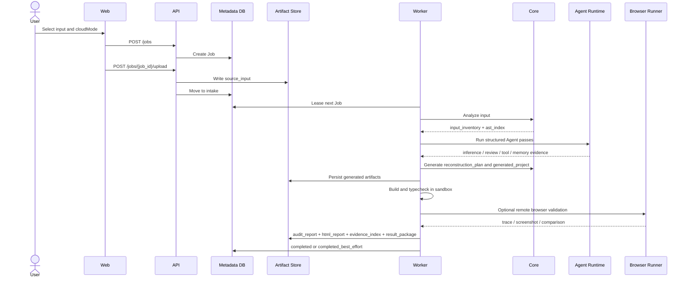
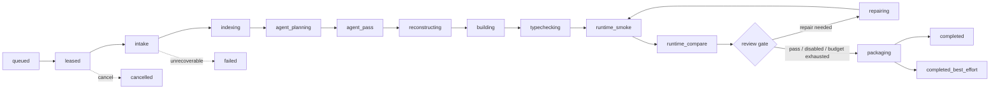
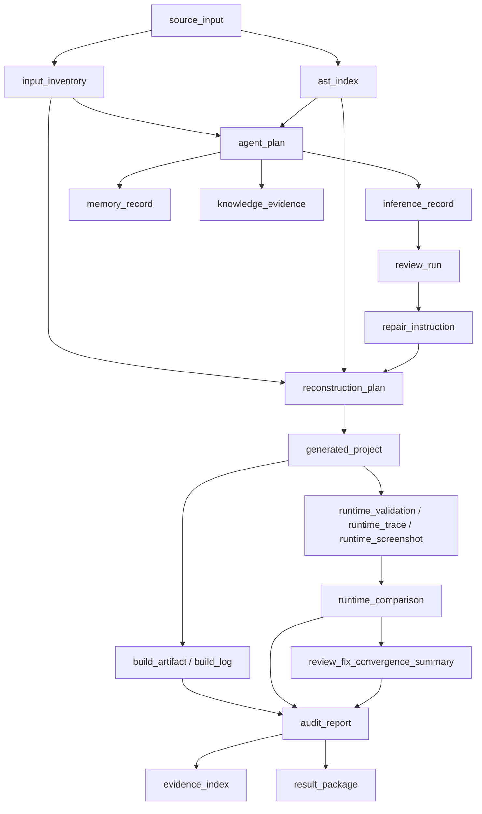

# 架构设计

AI JS Unpack 由 Web、API、Worker、Headless Core、Agent Runtime、Sandbox、Browser Runner、Metadata DB 和 Artifact Store 组成。核心原则是：确定性分析与写出负责工程产物，Agent 只通过结构化证据影响结果，所有阶段都保留可审计 Artifact lineage。

## 总体架构

## 模块职责

- `apps/web`：上传输入、创建 Job、展示状态、Artifact、runtime validation、Agent evidence、报告和下载入口。
- `apps/api`：认证、Job 生命周期、Artifact 下载、报告聚合、rerun/cancel、retention cleanup、Ops metrics 和 alerts。
- `apps/worker`：领取 Job，串联 Core、Agent、reconstruction、build/typecheck、runtime smoke/compare、review/fix 和 packaging。
- `apps/browser_runner`：独立执行 Playwright capture，提供队列、lease recovery、metrics 和远程执行边界证据。
- `packages/core`：输入规范化、文件清单、HTML 引用解析、AST 索引、Source Map 分析、低风险转换、重建计划和工程写出。
- `packages/shared`：Job、Artifact、Review、Runtime、Memory、Tool、Ops 等跨 TS/Python 契约。
- `packages/sandbox`：本地、容器、gVisor、Firecracker 和 remote browser runner profile 的执行策略与审计含义。
- `packages/deployment`：按服务角色校验环境变量，避免 API 接收 Worker/sandbox/model provider 配置。

## 作业生命周期

## Worker Pipeline

关键约束：

- Agent 输出必须经过 schema 校验和证据绑定，不能直接自由改写最终工程。
- Deterministic writer 只消费结构化 plan 和低风险 repair instruction。
- `completed_best_effort` 必须保留失败分类、限制说明、证据和可下载产物。
- 每个 attempt 都应写入新 artifact，便于回溯和复现。

## Artifact Lineage

## Browser Runner 边界

Browser Runner 可以把 Playwright 工作从 Worker 中拆出。Worker 将源输入或生成工程打包为受控 source archive，Browser Runner 在独立服务内执行 capture，返回 console、network、DOM、screenshot 和 execution boundary。`runtime_trace.executionBoundary` 会记录 runner kind、remote run id、queue backend、attempt、lease recovery、队列长度、运行耗时和告警状态。

## 数据与安全模型

- Job 状态由 `packages/shared` 的 `JOB_STATUSES` 定义。
- Artifact kind 包括 `source_input`、`input_inventory`、`ast_index`、`reconstruction_plan`、`generated_project`、`runtime_validation`、`runtime_trace`、`runtime_comparison`、`audit_report`、`result_package` 等。
- `cloudMode` 包括 `cloud_allowed`、`local_only`、`desensitized`。
- Artifact 带有 `sensitivityClass`、`retentionClass`、`parentArtifactIds`、`producer`、`hash` 和生命周期字段。
