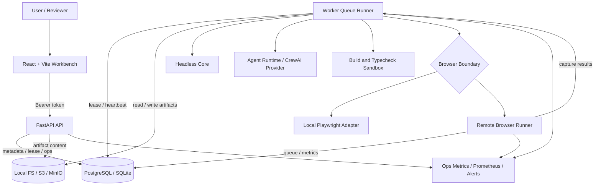
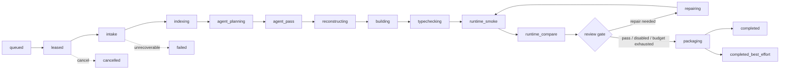
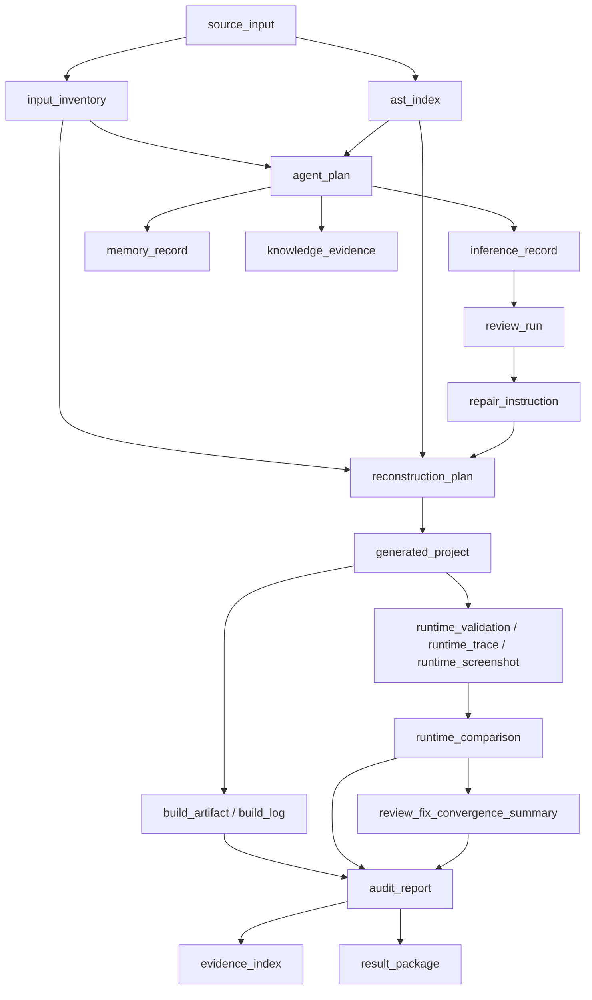

# 架构设计

AI JS Unpack 由 Web、API、Worker、Headless Core、Agent Runtime、Sandbox、Browser Runner、Metadata DB 和 Artifact Store 组成。核心原则是：确定性代码负责解析、重建、验证和写出；Agent 只通过结构化证据影响审计、诊断和低风险修复；所有阶段都保留可追溯 artifact lineage。

## 总体架构

## 模块职责

- `apps/web`：React/Vite 工作台，负责创建 Job、上传输入、展示状态、artifact、runtime validation、Agent evidence、报告和下载入口。
- `apps/api`：FastAPI 服务，负责 HMAC Bearer 认证、Job 生命周期、artifact 下载、报告聚合、rerun/cancel、retention cleanup、Ops metrics、Prometheus 和 alert events。
- `apps/worker`：队列消费者，串联 Core、Agent、reconstruction、build/typecheck、runtime smoke/compare、review/fix 和 packaging。
- `apps/browser_runner`：独立 FastAPI 服务，执行 Playwright capture，提供 Browser Run 队列、lease recovery、metrics、health 和远程执行边界证据。
- `packages/core`：Headless TypeScript core，负责输入规范化、文件清单、HTML 引用解析、AST 索引、source map 分析、重建计划和工程写出。
- `packages/shared`：跨 TS/Python 的契约来源，定义 Job、Artifact、Review、Runtime、Browser Runner、Ops、Tool、Memory 和 Retention 类型。
- `packages/sandbox`：本地、容器、gVisor、Firecracker 和 remote browser runner profile 的执行策略与审计含义。
- `packages/deployment`：按服务角色校验环境变量，避免 API 携带 Worker、sandbox、Browser Runner 或模型 provider 配置。
- `deploy/`：Docker Compose、本地/CI smoke、release gate、release evidence manifest、release archive 和 Firecracker launcher 模板。

## Job 生命周期

## Worker Pipeline

关键约束：

- Agent 输出必须通过 schema 和 evidence 绑定，不能直接自由改写最终工程。
- Deterministic writer 只消费结构化 plan 和低风险 repair instruction。
- `completed_best_effort` 必须保留失败分类、限制说明、证据和可下载产物。
- 每个 attempt 都写入新 artifact，便于审计、回溯和复现。
- runtime compare 的 review/fix 有重试预算；预算耗尽或 repair 不适用时进入 best-effort 收敛记录，而不是静默覆盖失败。

## Agent Runtime 分层

Agent Runtime 是 Worker Pipeline 内的模型辅助层，不直接拥有最终工程写权限。当前分层为：

- `agent_runtime.py`：编排 memory、knowledge、provider 和 artifact 写入顺序。
- `agent_contracts.py`：定义 Agent request/result、provider draft、review/repair/report draft 和 CrewAI structured output。
- `agent_context.py`：构建输入摘要、evidence refs，并在 `cloudMode=desensitized` 时执行确定性脱敏。
- `agent_providers.py`：封装 CrewAI provider、模型策略、Crew task 组装和 provider 失败 fallback。
- `agent_feedback.py`：把当前 Job 与同项目历史 Review/Fix evidence 转成保守 inference、diagnosis 和 repair hints。
- `agent_tools.py`：用声明式 `ToolSpec` 生成 tool registry，并标记 CrewAI provider 为 stateful、not parallel-safe。
- `agent_artifacts.py`：集中写入 plan、inference、runtime diagnosis、report section、repair instruction、review 和 tool call artifacts。

## Artifact Lineage

Artifact 记录 `kind`、`stage`、`attempt`、`schemaVersion`、`contentType`、`hash`、`storageUri`、`parentArtifactIds`、`producer`、`sensitivityClass`、`retentionClass`、`createdAt`、`expiresAt` 和删除信息。公开契约版本由 `packages/shared` 的 `CONTRACT_SCHEMA_VERSION` 定义。

## Browser Runner 边界

Browser Runner 把 Playwright 工作从 Worker 中拆出。Worker 将源输入或生成工程打包为受控 source archive，Browser Runner 在独立服务内执行 capture，并返回 console、network、DOM、screenshot、assertion 和 execution boundary。

Browser Runner 支持两种队列 backend：

- `sqlite`：单实例本地运行。
- `postgresql`：多实例部署，推荐与 Metadata DB 共用 PostgreSQL。

`runtime_trace.executionBoundary` 和 `BrowserRunSummary` 记录 runner kind、remote run id、queue backend、attempt、lease recovery、队列长度、claim latency、run duration、retry rate、backend health 和 alert fields，使远程浏览器执行在结果包中可审计。

## 数据与安全模型

- Job 状态由 `packages/shared` 的 `JOB_STATUSES` 定义，终态为 `completed`、`completed_best_effort`、`failed` 和 `cancelled`。
- `cloudMode` 包括 `cloud_allowed`、`local_only`、`desensitized`。
- Failure class 包括 `invalid_input`、`parse_error`、`agent_failed`、`dependency_missing`、`install_failed`、`type_error`、`build_error`、`runtime_error`、`sandbox_denied`、`policy_denied`、`timeout`、`resource_limit` 和 `unknown`。
- Sandbox runner kind 包括 `local`、`container`、`gvisor`、`firecracker` 和 `remote_browser_runner`。
- API 服务在 strict role 下拒绝 Worker、sandbox、Browser Runner、Core CLI 和模型 provider 配置，防止职责混入。
- Ops 通过 heartbeat、metrics、Prometheus exposition、alert 计算和 webhook delivery 形成运维证据，但不公开匿名指标，因为实例、队列、Job 状态和 alert label 都属于敏感运维信息。
