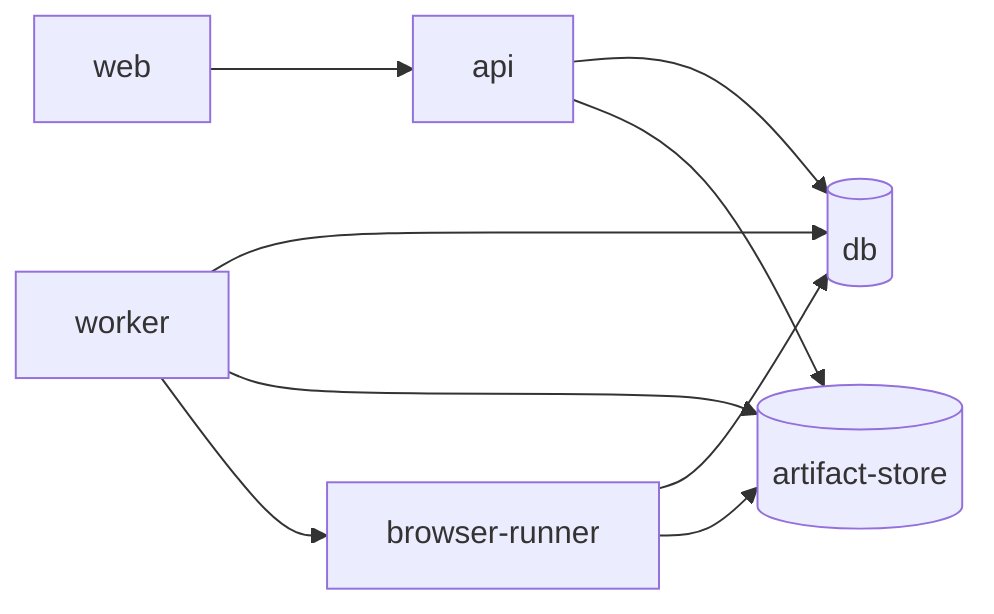

# 部署指南

本文档说明 AI JS Unpack 的服务边界、环境变量、Docker Compose 起点和生产部署建议。

## 服务边界



- `web`：React 工作台，只接收 `VITE_API_*` 配置。
- `api`：HTTP、认证、Job/Artifact 元数据、报告下载和 Ops 接口。
- `worker`：Core CLI、Agent Runtime、build/typecheck sandbox、runtime validation 和 packaging。
- `browser-runner`：独立 Playwright 执行、队列、lease recovery、metrics 和 runtime evidence。
- `db`：PostgreSQL 元数据存储，可承载 Job、Artifact metadata、Worker lease、Browser Runner queue 和 Ops heartbeat。
- `artifact-store`：S3/MinIO 或本地文件系统兼容的 Artifact 内容存储。

## Docker Compose

本仓库提供本地部署合约：

```powershell
docker compose -f deploy/docker-compose.yml up db artifact-store api web
docker compose -f deploy/docker-compose.yml --profile worker --profile browser-runner up
```

生产部署前需要替换 compose 中的占位镜像：

- `ai-jsunpack/api:local`
- `ai-jsunpack/worker:local`
- `ai-jsunpack/browser-runner:local`
- `ai-jsunpack/web:local`

## 环境变量文件

样例文件位于 `deploy/env/`：

- `api.env.example`
- `worker.env.example`
- `browser-runner.env.example`
- `web.env.example`
- `db.env.example`
- `artifact-store.env.example`

生产环境必须替换所有占位 secret、数据库密码、S3/MinIO 凭证、token 和 webhook 配置。

## API 配置

核心变量：

- `AI_JSUNPACK_SERVICE_ROLE=api`
- `AI_JSUNPACK_AUTH_SECRET`
- `AI_JSUNPACK_CORS_ORIGINS`
- `AI_JSUNPACK_DATABASE_URL`
- `AI_JSUNPACK_ARTIFACT_STORE`
- `AI_JSUNPACK_ARTIFACT_S3_*`
- `AI_JSUNPACK_ALERT_WEBHOOK_URL`
- `AI_JSUNPACK_ALERT_RULES_JSON`

当 `AI_JSUNPACK_SERVICE_ROLE=api` 时，API 会拒绝 Worker、sandbox、Browser Runner 或模型 provider 执行侧配置，防止职责混入。

## Worker 配置

核心变量：

- `AI_JSUNPACK_SERVICE_ROLE=worker`
- `AI_JSUNPACK_WORKER_ID`
- `AI_JSUNPACK_WORKER_LEASE_SECONDS`
- `AI_JSUNPACK_WORKER_POLL_SECONDS`
- `AI_JSUNPACK_WORKER_MAX_ATTEMPTS`
- `AI_JSUNPACK_SANDBOX_RUNNER`
- `AI_JSUNPACK_BROWSER_RUNNER_URL`
- `AI_JSUNPACK_BROWSER_RUNNER_TOKEN`
- `AI_JSUNPACK_AGENT_MODEL`
- `AI_JSUNPACK_LOCAL_AGENT_MODEL`

Worker 负责执行 Core、Agent、build/typecheck、runtime validation 和 packaging，因此它可以访问模型 provider、sandbox、Artifact Store 和 Browser Runner 配置。

## Sandbox Profile

支持的 runner kind：

| runnerKind | enforcement | 用途 |
| --- | --- | --- |
| `local` | `local_best_effort` | 本地临时目录执行，适合开发 |
| `container` | `container_enforced` | Docker/Podman 容器执行 |
| `gvisor` | `runtime_isolated` | Docker/Podman + `runsc` runtime |
| `firecracker` | `runtime_isolated` | 部署方提供 Firecracker launcher |
| `remote_browser_runner` | `remote_isolated` | 浏览器执行边界，不执行 build/typecheck |

高隔离 profile 未配置时会写入 `sandbox_denied` evidence，不会静默降级到本地执行。

Firecracker 模板位于 `deploy/firecracker/launcher.py`，部署前需要准备 kernel、rootfs、jailer、Firecracker binary、exchange directory 和 wrapper command。

## Browser Runner 配置

核心变量：

- `AI_JSUNPACK_SERVICE_ROLE=browser-runner`
- `AI_JSUNPACK_BROWSER_RUNNER_QUEUE_BACKEND`
- `AI_JSUNPACK_BROWSER_RUNNER_QUEUE_DATABASE_URL`
- `AI_JSUNPACK_BROWSER_RUNNER_WORKERS`
- `AI_JSUNPACK_BROWSER_RUNNER_MAX_ATTEMPTS`
- `AI_JSUNPACK_BROWSER_RUNNER_LEASE_SECONDS`
- `AI_JSUNPACK_BROWSER_RUNNER_POLL_SECONDS`
- `AI_JSUNPACK_BROWSER_RUNNER_MAX_QUEUE_AGE_MS`
- `AI_JSUNPACK_BROWSER_RUNNER_MAX_CLAIM_LATENCY_MS`
- `AI_JSUNPACK_BROWSER_RUNNER_MAX_EXPIRED_RUNNING`
- `AI_JSUNPACK_BROWSER_RUNNER_MAX_RETRY_RATE`

多实例部署建议使用 `postgresql` queue backend，共享 Metadata DB。SQLite backend 只建议用于单实例本地运行。

## Ops、Prometheus 与告警

API、Worker 和 Browser Runner 都会写入 ops heartbeat。API 提供：

- `/ops/heartbeats`
- `/ops/metrics`
- `/ops/prometheus`
- `/ops/alerts`
- `/ops/alert-events`

Prometheus scrape 必须携带拥有 ops read 权限的 Bearer token。告警规则可以通过 `AI_JSUNPACK_ALERT_RULES_JSON` 扩展，webhook 由 `AI_JSUNPACK_ALERT_WEBHOOK_URL` 配置。

## CI/CD 建议

推荐流水线：

1. 安装 Node 和 Python 依赖。
2. 运行 `npm run check`、`npm run test:core`、Python compileall 和 unittest。
3. 构建 API、Worker、Browser Runner、Web 镜像。
4. 执行 compose smoke：API `/health`、Web 静态入口、Worker heartbeat、Browser Runner `/health`。
5. 发布镜像并按环境注入 secret。
6. 部署后检查 `/ops/metrics`、`/ops/prometheus` 和 alert event。

## 生产上线检查

- 所有服务使用非占位 secret 和最小权限凭证。
- API 与 Worker/Browser Runner 使用不同服务角色配置。
- Artifact Store lifecycle 和 retention 策略已配置。
- Sandbox runner 与网络策略符合安全要求。
- Browser Runner 队列容量、retry、lease recovery 和告警阈值已压测。
- 结果包下载、审计报告、Prometheus scrape 和 webhook 投递已验证。
