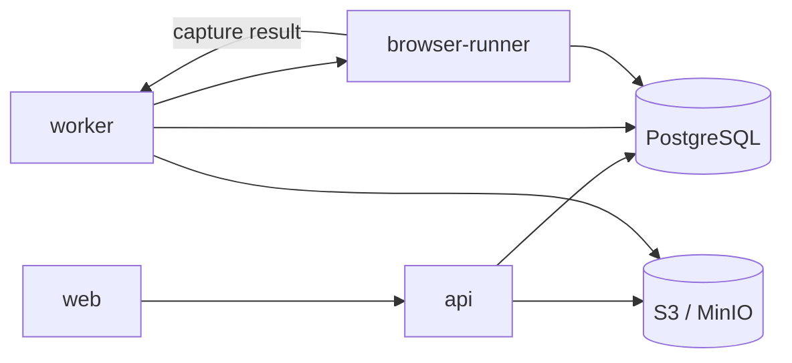

# 部署指南

本页说明服务拓扑、配置分工、Compose、隔离执行和发布证据。实现级命令与参数以 `deploy/README.md`、`deploy/firecracker/README.md` 和 `deploy/*.py --help` 为准。

## 部署目标



服务边界：

- `web`：静态 React/Vite 应用，只接收 `VITE_API_*`。
- `api`：HTTP、认证、Job/Artifact、Settings、报告和 Ops；不得携带 Worker 执行权限。
- `worker`：Core、Agent Runtime、sandbox、runtime compare、review/fix 和 packaging。
- `browser-runner`：独立 Playwright 执行、持久队列、lease recovery 和 capture evidence。
- `db`：Job、Artifact metadata、settings revisions、leases、heartbeats 和可选 Browser Runner queue。
- `artifact-store`：输入、生成工程、日志、截图、报告和结果包内容。

## 配置分工

推荐将非 secret 启动配置放入 JSON/YAML，将部署差异和 secret 放入平台环境或 secret manager。

- 通用模型：[配置指南](configuration.md)。
- 可提交示例：`config/ai-jsunpack.example.{yaml,json}`。
- Compose 环境模板：`deploy/env/*.example`。
- 本地 secret 模板：`.example.env`。

部署环境模板：

- `deploy/env/api.env.example`
- `deploy/env/worker.env.example`
- `deploy/env/browser-runner.env.example`
- `deploy/env/web.env.example`
- `deploy/env/db.env.example`
- `deploy/env/artifact-store.env.example`

这些文件是变量全集和注释事实源；本页只解释边界，不复制所有变量。

### Secret

生产 secret 至少包括：

- HMAC auth secret。
- PostgreSQL 凭据。
- S3/MinIO access key 与 secret key。
- Browser Runner service token。
- Worker-only 模型 provider key。
- webhook 或其他外部集成凭据。

使用 GitHub Environment、Kubernetes Secret、Vault、SOPS/SealedSecrets 或等价机制。`*SecretRef` 配置字段只是引用标识，仓库当前没有通用 secret resolver；部署平台仍需把实际值注入服务环境。

## Docker Compose

构建并启动完整本地拓扑：

```powershell
docker compose -p ai-jsunpack-smoke -f deploy/docker-compose.yml --profile worker --profile browser-runner build
docker compose -p ai-jsunpack-smoke -f deploy/docker-compose.yml --profile worker --profile browser-runner up -d
docker compose -p ai-jsunpack-smoke -f deploy/docker-compose.yml --profile worker --profile browser-runner ps
```

停止：

```powershell
docker compose -p ai-jsunpack-smoke -f deploy/docker-compose.yml --profile worker --profile browser-runner down
```

先做静态 Compose 验证：

```powershell
docker compose -f deploy/docker-compose.yml config --quiet
```

Compose 默认从 `deploy/docker/` 构建本地镜像，也可使用不可变 tag 覆盖：

- `AI_JSUNPACK_API_IMAGE`
- `AI_JSUNPACK_WORKER_IMAGE`
- `AI_JSUNPACK_BROWSER_RUNNER_IMAGE`
- `AI_JSUNPACK_WEB_IMAGE`

PostgreSQL、MinIO、API、Browser Runner 和 Web 有 healthcheck。`artifact-store-init` 创建 bucket；Worker 是长驻消费者，通过 heartbeat 和 deployment smoke 验证。

## 生产 Profile

生产配置设置：

```yaml
shared:
  deploymentProfile: production
```

生产不变量：

- API 不接收 Worker、sandbox、Browser Runner、Core CLI 或 provider 变量。
- 本地 host sandbox 被拒绝；选择 container、gVisor 或 Firecracker。
- 本地 Playwright fallback 被拒绝；配置远程 Browser Runner。
- 隔离 runner 配置缺失时返回 `sandbox_denied`/`policy_denied`，不能静默降级。
- object-store、DB、队列和服务 token 必须在实例间一致且可轮换。

## Sandbox

| runner | enforcement | 适用场景 |
| --- | --- | --- |
| `local` | `local_best_effort` | 本地开发；不提供生产多租户隔离 |
| `container` | `container_enforced` | Docker/Podman 容器 |
| `gvisor` | `runtime_isolated` | 容器 + `runsc` |
| `firecracker` | `runtime_isolated` | KVM microVM，由部署方提供 launcher/wrapper |
| `remote_browser_runner` | `remote_isolated` | 仅浏览器执行，不替代 build/typecheck sandbox |

Firecracker 需要 Linux、`/dev/kvm`、固定版本的 binary/jailer、kernel、rootfs、交换目录和 wrapper。完整请求协议与 smoke 清单见 `deploy/firecracker/README.md`。该文件引用的 Worker 模板实际路径是 `deploy/env/worker.env.example`。

## Browser Runner

单实例开发可使用 SQLite：

```text
AI_JSUNPACK_BROWSER_RUNNER_QUEUE_BACKEND=sqlite
AI_JSUNPACK_BROWSER_RUNNER_DB_PATH=tmp/local-dev/browser-runner/browser-runs.sqlite3
```

多实例生产使用 PostgreSQL：

```text
AI_JSUNPACK_BROWSER_RUNNER_QUEUE_BACKEND=postgresql
AI_JSUNPACK_BROWSER_RUNNER_QUEUE_DATABASE_URL=<shared database URL>
```

Browser Runner 镜像必须安装 Playwright browsers，并与 Worker 使用同一 HMAC secret 验证 service token。`/health` 可匿名用于编排健康检查；`/browser-runs/*` 和 metrics 需要 worker service token。

## Ops 与告警

API 提供：

- `/ops/heartbeats`
- `/ops/metrics`
- `/ops/prometheus`
- `/ops/alerts`
- `/ops/alert-events`

Prometheus scrape 必须携带 ops read Bearer token。告警规则由 `AI_JSUNPACK_ALERT_RULES_JSON` 扩展，webhook 由 `AI_JSUNPACK_ALERT_WEBHOOK_URL` 配置。生产环境应对 heartbeat 过期、队列年龄、claim latency、retry rate、失败 Job 和告警投递失败设置可操作阈值。

## 自动化验收

### 无 Docker smoke

```powershell
python -m apps.api.app.deployment_smoke --output tmp\deployment-smoke.json
```

该检查使用临时 DB/Artifact Store、API TestClient、受控 Worker pipeline、合成 Browser Runner soak、webhook 和 retention cleanup。通过要求进程返回 0 且报告 `status=pass`。

### Compose dry-run

```powershell
python -m deploy.compose_smoke --dry-run --output tmp\deployment-compose-smoke\dry-run.json
```

### Compose smoke

```powershell
python -m deploy.compose_smoke `
  --output tmp\deployment-compose-smoke\compose-smoke.json `
  --artifact-root tmp\deployment-compose-smoke\artifacts `
  --soak-runs 10
```

发布证据至少要求：

- `compose-smoke.json.status=pass`
- `deploymentSmoke.status=pass`
- `deploymentSmoke.archive_manifest.archiveReady=true`
- retained evidence 包含结果包 hash、报告、Prometheus、alert、retention 和 Browser Runner soak

## Release Gate

Dry-run 只生成计划与报告：

```powershell
python -m deploy.release_gate `
  --registry registry.example.com `
  --repository-prefix ai-jsunpack `
  --version <immutable-version> `
  --git-sha <commit-sha> `
  --previous-version <known-good-version> `
  --output tmp\release-gate\release-gate.json `
  --dry-run
```

执行模式：

```powershell
python -m deploy.release_gate `
  --registry registry.example.com `
  --repository-prefix ai-jsunpack `
  --version <immutable-version> `
  --git-sha <commit-sha> `
  --previous-version <known-good-version> `
  --execute `
  --push
```

`--execute` 构建镜像、生成 SBOM、运行扫描并执行 Compose smoke。默认工具是 `syft` 和 `trivy`；`none` 只用于已批准并记录的例外。

### GitHub Actions 当前前置条件

`.github/workflows/release-gate.yml` 使用 `npm ci`，因此干净检出必须包含已跟踪的 `package-lock.json`。当前仓库的 `.gitignore` 忽略该文件，版本树中也没有 lockfile；真实 workflow 会在安装阶段失败。

在修复 lockfile 策略并由一次真实 Actions run 证明前：

- 可以使用 `deploy.release_gate --dry-run` 和本地验证。
- 不应把 GitHub Release Gate 宣称为可用的生产门禁。
- 推荐修复是跟踪 `package-lock.json` 并继续使用 `npm ci`，而不是在 CI 中放弃可重复安装。

## 生产证据归档

从 release gate 生成待填 manifest：

```powershell
python -m deploy.release_evidence_manifest `
  --release-gate-report tmp\release-gate\release-gate.json `
  --compose-smoke-report tmp\release-gate\compose-smoke.json `
  --deployment-smoke-report tmp\release-gate\deployment-smoke.json `
  --output tmp\release-gate\production-evidence-manifest.json
```

最终校验：

```powershell
python -m deploy.release_archive `
  --release-gate-report tmp\release-gate\release-gate.json `
  --compose-smoke-report tmp\release-gate\compose-smoke.json `
  --deployment-smoke-report tmp\release-gate\deployment-smoke.json `
  --evidence-manifest tmp\release-gate\production-evidence-manifest.json `
  --output tmp\release-gate\production-release-archive.json
```

外部 manifest 记录引用和 digest，不记录 secret。至少保留：CI run、registry digest、secret manager revision/approval、DB snapshot、Artifact Store export、service logs 和 rollback evidence。

## 故障与回滚

```powershell
docker compose -p ai-jsunpack-smoke -f deploy/docker-compose.yml --profile worker --profile browser-runner ps
docker compose -p ai-jsunpack-smoke -f deploy/docker-compose.yml --profile worker --profile browser-runner logs --tail 120
```

常见问题：

- DB/MinIO 不健康：检查端口、凭据、bucket 与共享 URL。
- API 立即退出：检查是否误注入 Worker/provider/sandbox 变量。
- Worker 空闲：检查租约、source input、共享 DB 和 Artifact Store。
- Browser Runner degraded：检查 queue backend、lease/retry、Playwright 和 service token。
- `policy_denied`：检查 deployment profile、cloud mode、模型与隔离边界。
- 结果包缺失：检查 packaging 日志、失败检查和 retained Artifact。

回滚前先保存日志、报告、DB/Artifact Store 快照和 registry digest，再切换到上一组不可变镜像。回滚后重新运行 Compose smoke，并对比结果包 hash、Prometheus 和 alert evidence。

## 上线清单

- 所有镜像使用不可变 tag 和 registry digest。
- 所有 secret 为非占位值、最小权限并可轮换。
- API/Worker/Browser Runner/Web 的变量没有越界。
- PostgreSQL、Artifact Store 和 Browser Runner queue 已做备份与容量验证。
- sandbox 和浏览器网络策略已验证 fail closed。
- provider 凭据只存在于 Worker。
- smoke/soak、报告下载、Prometheus 和 webhook 已验证。
- 发布、回滚和外部证据已归档。
