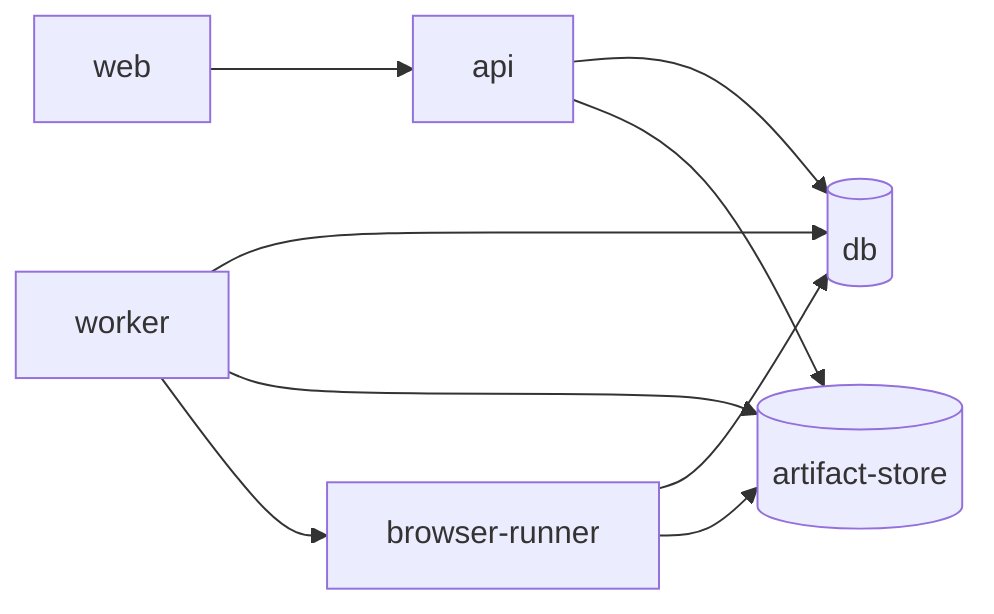

# 部署指南

本文档说明 AI JS Unpack 的服务边界、环境变量、Docker Compose、release gate、生产证据归档和回滚流程。部署目录的局部说明见 `deploy/README.md` 和 `deploy/firecracker/README.md`。

## 服务边界



- `web`：React/Vite 工作台，只接收 `VITE_API_*` 配置。
- `api`：HTTP、认证、Job/Artifact 元数据、报告下载和 Ops 接口；不得携带 Worker、sandbox、Browser Runner、Core CLI 或模型 provider 配置。
- `worker`：Core CLI、Agent Runtime、build/typecheck sandbox、runtime validation、review/fix 和 packaging。
- `browser-runner`：独立 Playwright 执行、队列、lease recovery、metrics、health 和 runtime evidence。
- `db`：PostgreSQL 元数据存储，可承载 Job、Artifact metadata、Worker lease、Browser Runner queue 和 Ops heartbeat。
- `artifact-store`：S3/MinIO 或本地文件系统兼容的 Artifact 内容存储。

## Docker Compose

本仓库提供本地部署契约：

```powershell
docker compose -p ai-jsunpack-smoke -f deploy/docker-compose.yml --profile worker --profile browser-runner build
docker compose -p ai-jsunpack-smoke -f deploy/docker-compose.yml --profile worker --profile browser-runner up -d
docker compose -p ai-jsunpack-smoke -f deploy/docker-compose.yml --profile worker --profile browser-runner ps
```

停止：

```powershell
docker compose -p ai-jsunpack-smoke -f deploy/docker-compose.yml --profile worker --profile browser-runner down
```

Compose 默认从本仓库构建本地镜像，也可以用 CI 发布的不可变镜像覆盖：

- `AI_JSUNPACK_API_IMAGE`
- `AI_JSUNPACK_WORKER_IMAGE`
- `AI_JSUNPACK_BROWSER_RUNNER_IMAGE`
- `AI_JSUNPACK_WEB_IMAGE`

服务 Dockerfile 位于 `deploy/docker/`。PostgreSQL、MinIO、API、Browser Runner 和 Web 都有 healthcheck；`artifact-store-init` 会在 API、Worker 或 Browser Runner 启动前创建 MinIO bucket。Worker 是长驻队列消费者，通过 ops heartbeat 和 deployment smoke 验证。

## 环境变量模板

样例文件位于 `deploy/env/`：

- `api.env.example`
- `worker.env.example`
- `browser-runner.env.example`
- `web.env.example`
- `db.env.example`
- `artifact-store.env.example`

生产环境必须替换所有占位 secret、数据库密码、S3/MinIO 凭证、token 和 webhook 配置。Secret 必须来自 CI secret store、Kubernetes Secret、Vault、SOPS/SealedSecrets 或等价机制，不写入仓库。

## 核心配置

API：

- `AI_JSUNPACK_SERVICE_ROLE=api`
- `AI_JSUNPACK_AUTH_SECRET`
- `AI_JSUNPACK_CORS_ORIGINS`
- `AI_JSUNPACK_DATABASE_URL`
- `AI_JSUNPACK_ARTIFACT_STORE`
- `AI_JSUNPACK_ARTIFACT_S3_*`
- `AI_JSUNPACK_MAX_UPLOAD_BYTES`
- `AI_JSUNPACK_ALERT_WEBHOOK_URL`
- `AI_JSUNPACK_ALERT_WEBHOOK_TIMEOUT_SECONDS`
- `AI_JSUNPACK_ALERT_RULES_JSON`

Worker：

- `AI_JSUNPACK_SERVICE_ROLE=worker`
- `AI_JSUNPACK_WORKER_ID`
- `AI_JSUNPACK_WORKER_LEASE_SECONDS`
- `AI_JSUNPACK_WORKER_POLL_SECONDS`
- `AI_JSUNPACK_WORKER_MAX_ATTEMPTS`
- `AI_JSUNPACK_SANDBOX_RUNNER`
- `AI_JSUNPACK_SANDBOX_IMAGE`
- `AI_JSUNPACK_BROWSER_RUNNER_URL`
- `AI_JSUNPACK_BROWSER_RUNNER_TOKEN`
- `AI_JSUNPACK_AGENT_MODEL`
- `AI_JSUNPACK_AGENT_PROVIDER`
- `AI_JSUNPACK_AGENT_BASE_URL`
- `AI_JSUNPACK_AGENT_API_KEY`
- `AI_JSUNPACK_AGENT_TIMEOUT_SECONDS`
- `AI_JSUNPACK_AGENT_TEMPERATURE`
- `AI_JSUNPACK_LOCAL_AGENT_MODEL`
- `AI_JSUNPACK_LOCAL_AGENT_PROVIDER`
- `AI_JSUNPACK_LOCAL_AGENT_BASE_URL`
- `AI_JSUNPACK_LOCAL_AGENT_API_KEY`
- `AI_JSUNPACK_CREWAI_DATA_ROOT`
- provider 凭据只注入 Worker，例如 `OPENAI_API_KEY`、`ANTHROPIC_API_KEY`、`GOOGLE_API_KEY`、`AZURE_OPENAI_API_KEY`、`OLLAMA_ENDPOINT`

Browser Runner：

- `AI_JSUNPACK_SERVICE_ROLE=browser-runner`
- `AI_JSUNPACK_AUTH_SECRET`
- `AI_JSUNPACK_BROWSER_RUNNER_QUEUE_BACKEND`
- `AI_JSUNPACK_BROWSER_RUNNER_QUEUE_DATABASE_URL`
- `AI_JSUNPACK_BROWSER_RUNNER_DB_PATH`
- `AI_JSUNPACK_BROWSER_RUNNER_WORKDIR`
- `AI_JSUNPACK_BROWSER_RUNNER_WORKERS`
- `AI_JSUNPACK_BROWSER_RUNNER_MAX_ATTEMPTS`
- `AI_JSUNPACK_BROWSER_RUNNER_LEASE_SECONDS`
- `AI_JSUNPACK_BROWSER_RUNNER_RETRY_BACKOFF_SECONDS`
- `AI_JSUNPACK_BROWSER_RUNNER_POLL_SECONDS`
- `AI_JSUNPACK_BROWSER_RUNNER_MAX_QUEUE_AGE_MS`
- `AI_JSUNPACK_BROWSER_RUNNER_MAX_CLAIM_LATENCY_MS`
- `AI_JSUNPACK_BROWSER_RUNNER_MAX_EXPIRED_RUNNING`
- `AI_JSUNPACK_BROWSER_RUNNER_MAX_RETRY_RATE`

Web：

- `VITE_API_BASE_URL`
- `VITE_API_AUTH_TOKEN`
- `VITE_API_USER_ID`
- `VITE_API_PROJECT_ID`

## Agent 模型与凭据

Agent Runtime 只属于 Worker。模型选择有两层入口：

- Job config：`config.agentModel`、`config.agentModelProvider`、`config.localAgentModel`、`config.localAgentProvider`。
- Worker 环境变量：`AI_JSUNPACK_AGENT_MODEL`、`AI_JSUNPACK_AGENT_PROVIDER`、`AI_JSUNPACK_AGENT_BASE_URL`、`AI_JSUNPACK_AGENT_API_KEY`、`AI_JSUNPACK_LOCAL_AGENT_MODEL`、`AI_JSUNPACK_LOCAL_AGENT_PROVIDER`、`AI_JSUNPACK_LOCAL_AGENT_BASE_URL`、`AI_JSUNPACK_LOCAL_AGENT_API_KEY`。

`cloud_allowed` Job 需要 `config.agentModel` 或 `AI_JSUNPACK_AGENT_MODEL`；`local_only` Job 需要 `config.localAgentModel` 或 `AI_JSUNPACK_LOCAL_AGENT_MODEL`；`desensitized` Job 会先做上下文脱敏，再使用 cloud 或 local 模型变量。

如果 `AI_JSUNPACK_AGENT_PROVIDER=openai-compatible` 且配置 `AI_JSUNPACK_AGENT_BASE_URL`，cloud_allowed/desensitized Job 会通过 Worker 内置的 CrewAI `BaseLLM` 适配器调用 OpenAI Chat Completions 兼容 endpoint。local_only 对应 `AI_JSUNPACK_LOCAL_AGENT_PROVIDER=openai-compatible` 和 `AI_JSUNPACK_LOCAL_AGENT_BASE_URL`。请求会发送 `model`、`messages`、可选 `temperature` 和 CrewAI `tools`，并读取 `choices[0].message.content`。`AI_JSUNPACK_AGENT_TIMEOUT_SECONDS` 默认 30；`AI_JSUNPACK_AGENT_TEMPERATURE` 为空时不发送。

自定义 endpoint 的 API key 不写入 artifact 原文。Agent plan 和 execution audit 只记录 provider、model、base URL 是否配置、API key 是否配置、timeout 和 temperature。endpoint 超时、HTTP error 或响应格式不合法会进入 `agent_failed` evidence，不会中断 Core、重建、build/typecheck、runtime validation 或 packaging 的确定性证据链。

第三方 provider 凭据必须只注入 Worker，例如：

- `OPENAI_API_KEY`
- `ANTHROPIC_API_KEY`
- `GOOGLE_API_KEY`
- `AZURE_OPENAI_API_KEY`
- `OLLAMA_ENDPOINT`

不要把这些变量注入 API、Web 或 Browser Runner。API strict mode 会拒绝 `AI_JSUNPACK_AGENT_*`、`AI_JSUNPACK_LOCAL_AGENT_*` 和模型 provider 凭据，防止 HTTP 层进程携带 Worker 执行侧权限。`AI_JSUNPACK_AGENT_PROVIDER` 和 `AI_JSUNPACK_LOCAL_AGENT_PROVIDER` 会写入 policy/audit 证据；CrewAI 默认路径根据 `llm` 模型字符串和 provider credential 环境变量初始化 SDK。

## Sandbox Profile

| runnerKind | enforcement | 用途 |
| --- | --- | --- |
| `local` | `local_best_effort` | 本地临时目录执行，适合开发和审计，不声明 OS/container 隔离 |
| `container` | `container_enforced` | Docker/Podman 容器执行 |
| `gvisor` | `runtime_isolated` | Docker/Podman + `runsc` runtime |
| `firecracker` | `runtime_isolated` | 部署方提供 Firecracker/KVM/jailer/rootfs 和 launcher |
| `remote_browser_runner` | `remote_isolated` | 浏览器执行边界，不执行 Worker build/typecheck |

高隔离 profile 有意不回退到更弱 runner。设置 `AI_JSUNPACK_SANDBOX_RUNNER=gvisor` 但未配置 runtime，或设置 `firecracker` 但没有 launcher command 时，validation 会写入 `sandbox_denied` evidence，而不是静默改为本地执行。

Firecracker 模板位于 `deploy/firecracker/launcher.py`。生产部署前必须准备 kernel、rootfs、jailer、Firecracker binary、exchange directory 和 wrapper command，并按 `deploy/firecracker/README.md` 验收。

## Browser Runner 部署

Browser Runner ASGI app 是 `apps.browser_runner.app.main:app`。部署时使用与 Worker 相同的 `AI_JSUNPACK_AUTH_SECRET`，并在镜像中安装 Playwright browsers。

多实例部署建议使用：

- `AI_JSUNPACK_BROWSER_RUNNER_QUEUE_BACKEND=postgresql`
- `AI_JSUNPACK_BROWSER_RUNNER_QUEUE_DATABASE_URL=<shared metadata db>`

单实例本地运行才使用 `sqlite` 和 `AI_JSUNPACK_BROWSER_RUNNER_DB_PATH`。

`/health` 返回 `BrowserRunnerQueueHealth`，包括 backend status、queue metrics、worker settings、lease recovery 和 alerts；`/browser-runs/metrics` 返回相同队列指标但要求 worker service Bearer token。

## Ops、Prometheus 与告警

API、Worker 和 Browser Runner 都会写入 ops heartbeat。API 提供：

- `/ops/heartbeats`
- `/ops/metrics`
- `/ops/prometheus`
- `/ops/alerts`
- `/ops/alert-events`

Prometheus scrape 必须携带具备 ops read 权限的 Bearer token。告警规则可通过 `AI_JSUNPACK_ALERT_RULES_JSON` 扩展，webhook 由 `AI_JSUNPACK_ALERT_WEBHOOK_URL` 配置。

## 自动化验收

不依赖 Docker 的轻量生产验收：

```powershell
.venv\Scripts\python.exe -m apps.api.app.deployment_smoke `
  --output tmp\deployment-smoke.json
```

该命令使用临时 SQLite、临时 Artifact Store、API TestClient、受控 Worker pipeline、合成 Browser Runner soak、模拟 webhook 和 retention cleanup 检查。成功时报告 `status=pass` 且进程返回 0。

指定共享 DB 和持久 artifact 目录：

```powershell
.venv\Scripts\python.exe -m apps.api.app.deployment_smoke `
  --database-url "postgresql+psycopg://user:pass@db:5432/ai_jsunpack" `
  --artifact-root tmp\deployment-smoke-artifacts `
  --soak-instances 4 `
  --soak-workers-per-instance 2 `
  --soak-runs 200 `
  --output tmp\deployment-smoke-postgres.json
```

Docker Compose 演练：

```powershell
.venv\Scripts\python.exe -m deploy.compose_smoke `
  --output tmp\deployment-compose-smoke\compose-smoke.json `
  --artifact-root tmp\deployment-compose-smoke\artifacts `
  --soak-runs 10
```

只验证命令计划和报告结构：

```powershell
.venv\Scripts\python.exe -m deploy.compose_smoke --dry-run --output tmp\deployment-compose-smoke\dry-run.json
```

发布证据应满足：

- `compose-smoke.json.status=pass`
- `deploymentSmoke.status=pass`
- `deploymentSmoke.archive_manifest.archiveReady=true`
- retained evidence 包含结果包 hash、报告类型、Prometheus scrape、alert event、retention cleanup 和 Browser Runner soak 证据

## Release Gate

`deploy.release_gate` 是平台中立的 CI/CD 入口。默认 `--dry-run` 只生成发布计划和证据报告，不构建、不扫描、不推送镜像：

```powershell
.venv\Scripts\python.exe -m deploy.release_gate `
  --registry registry.example.com `
  --repository-prefix ai-jsunpack `
  --version 2026.06.26 `
  --git-sha <commit-sha> `
  --previous-version 2026.06.25 `
  --output tmp\release-gate\release-gate.json `
  --dry-run
```

执行模式：

```powershell
.venv\Scripts\python.exe -m deploy.release_gate `
  --registry registry.example.com `
  --repository-prefix ai-jsunpack `
  --version 2026.06.26 `
  --git-sha <commit-sha> `
  --previous-version 2026.06.25 `
  --execute `
  --push
```

`--execute` 会按报告顺序运行 Docker build、SBOM 生成、漏洞扫描和 `deploy.compose_smoke --skip-build`。未设置 `--push` 时不推送镜像。默认 SBOM 工具是 `syft`，默认扫描工具是 `trivy`；离线或未接入工具的环境可显式传入 `--sbom-tool none` 或 `--scan-tool none`，但发布评审应保留该例外。

报告会固化四类镜像 tag：

- `AI_JSUNPACK_API_IMAGE`
- `AI_JSUNPACK_WORKER_IMAGE`
- `AI_JSUNPACK_BROWSER_RUNNER_IMAGE`
- `AI_JSUNPACK_WEB_IMAGE`

## GitHub Actions 与 GHCR

仓库内置 `.github/workflows/release-gate.yml`，通过 `workflow_dispatch` 手动触发。默认 registry 是 `ghcr.io`，默认 repository prefix 是当前 `owner/repo`，job permissions 至少包含：

- `contents: read`
- `packages: write`

主要输入：

- `version`：不可变发布 tag，必填。
- `previous_version`：上一组已知可回滚 tag，建议生产发布填写。
- `repository_prefix`：GHCR namespace，默认当前 GitHub repository。
- `secret_environment`：持有生产 secret 的 GitHub Environment，默认 `production`。
- `push_images`：`true` 时执行 `docker push`。
- `sbom_tool`：默认 `syft`，可选 `none`。
- `scan_tool`：默认 `trivy`，可选 `none`。

Workflow 会先运行仓库基础验证，再安装发布工具并调用 `deploy.release_gate --ci-platform github_actions --secret-environment <environment> --execute`。当 `push_images=true` 时追加 `--push`，并使用 `GITHUB_TOKEN` 登录 GHCR。

Actions artifacts 会归档 `release-gate.json`、SBOM、扫描 JSON、`compose-smoke.json` 和 `deployment-smoke.json`。生产 DB snapshot、Artifact Store export、registry digest、服务日志、回滚证据和 GitHub Environment revision 或 approval record 仍必须在 runner workspace 外部保留。

## 发布归档校验

真实发布完成后，用 UTF-8 JSON manifest 记录外部运维证据，再运行 `deploy.release_archive` 生成最终归档校验报告。manifest 只记录证据引用、digest、revision、approval record 和快照位置，不记录 secret 值。

可先从 release gate 报告生成待填模板：

```powershell
.venv\Scripts\python.exe -m deploy.release_evidence_manifest `
  --release-gate-report tmp\release-gate\release-gate.json `
  --compose-smoke-report tmp\release-gate\compose-smoke.json `
  --deployment-smoke-report tmp\release-gate\deployment-smoke.json `
  --output tmp\release-gate\production-evidence-manifest.json
```

最终校验：

```powershell
.venv\Scripts\python.exe -m deploy.release_archive `
  --release-gate-report tmp\release-gate\release-gate.json `
  --compose-smoke-report tmp\release-gate\compose-smoke.json `
  --deployment-smoke-report tmp\release-gate\deployment-smoke.json `
  --evidence-manifest tmp\release-gate\production-evidence-manifest.json `
  --output tmp\release-gate\production-release-archive.json
```

校验通过要求：release gate 为执行模式且 `status=pass`，compose/deployment smoke 均通过，`archiveReady=true`，推送镜像有真实 registry digest，CI run、secret manager revision/approval、DB snapshot、Artifact Store export、service logs 和 rollback evidence 均有引用。

## 失败诊断与回滚

先查看 Compose 状态和健康检查：

```powershell
docker compose -p ai-jsunpack-smoke -f deploy/docker-compose.yml --profile worker --profile browser-runner ps
docker compose -p ai-jsunpack-smoke -f deploy/docker-compose.yml --profile worker --profile browser-runner logs --tail 120
```

常见问题：

- DB 不健康：检查 `db` 日志、端口占用和 `POSTGRES_*` 设置。
- MinIO 或 bucket init 失败：检查 `artifact-store`、`artifact-store-init` 日志，确认 MinIO 凭证和 `AI_JSUNPACK_ARTIFACT_S3_BUCKET` 一致。
- API 启动失败：检查部署 profile，API 不能接收 Worker/sandbox/Browser Runner/Core CLI/model provider 配置。
- Worker 空闲或 degraded：检查 `/ops/metrics`、Worker lease、共享 DB 和 Artifact Store 连接。
- Agent evidence 出现 `policy_denied`：检查 Job `cloudMode`、`config.*AgentModel`、Worker 的 `AI_JSUNPACK_*AGENT*_MODEL` 变量和 provider 凭据是否匹配。
- Browser Runner degraded：检查 `/health`、queue backend、lease/retry 阈值和 Playwright 镜像依赖。
- Prometheus 或告警失败：确认 Bearer token 使用共享 `AI_JSUNPACK_AUTH_SECRET` 签发并具备 ops read 权限。
- 结果包缺失：检查 Worker packaging 日志、`deploymentSmoke.failedChecks` 和 retained Artifact Store 内容。

回滚时先保留证据，再切回上一组镜像 tag：

```powershell
docker compose -p ai-jsunpack-smoke -f deploy/docker-compose.yml --profile worker --profile browser-runner logs --tail 200 > tmp\deployment-compose-smoke\compose-logs.txt
docker compose -p ai-jsunpack-smoke -f deploy/docker-compose.yml --profile worker --profile browser-runner down
```

保留 `release-gate.json`、`compose-smoke.json`、`deployment-smoke.json`、PostgreSQL dump 或 volume snapshot、Artifact Store bucket/prefix export、registry image digest、service logs、secret manager revision 和 rollback evidence。回退镜像后重新运行 `deploy.compose_smoke --skip-build`，并对比 `archive_manifest.retainedEvidence` 中的结果包 hash、报告类型、Prometheus 抓取和 alert event。

## 生产上线检查

- 所有服务使用非占位 secret 和最小权限凭证。
- API 与 Worker/Browser Runner 使用不同服务角色配置。
- Artifact Store lifecycle 和 retention 策略已配置。
- Sandbox runner 与网络策略符合安全要求。
- Worker 模型 provider 凭据和 Job `cloudMode` 策略已验证，且未注入 API/Web/Browser Runner。
- Browser Runner 队列容量、retry、lease recovery 和告警阈值已压测。
- 结果包下载、审计报告、Prometheus scrape 和 webhook 投递已验证。
- 发布证据、外部快照、registry digest、service logs 和回滚证据已归档。
