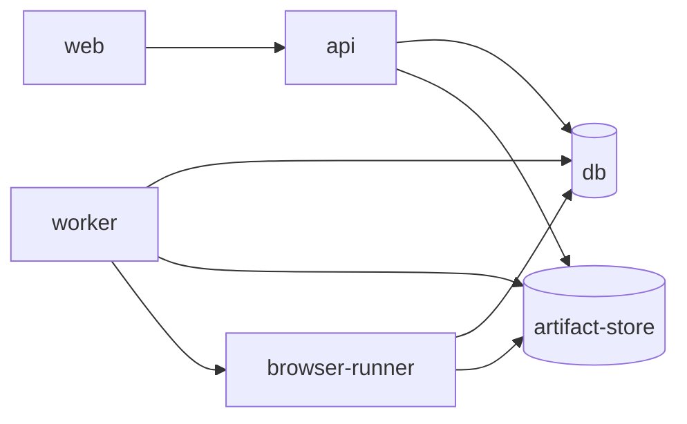

# 部署指南

本文档说明 AI JS Unpack 的服务边界、环境变量、Docker Compose 起点和生产部署建议。

## 服务边界



- `web`：React 工作台，只接收 `VITE_API_*` 配置。
- `api`：HTTP、认证、Job/Artifact 元数据、报告下载和 Ops 接口。
- `worker`：Core CLI、Agent Runtime、build/typecheck sandbox、runtime validation 和 packaging。
- `browser-runner`：独立 Playwright 执行、队列、lease recovery、metrics 和 runtime evidence。
- `db`：PostgreSQL 元数据存储，可承载 Job、Artifact metadata、Worker lease、Browser Runner queue 和 Ops heartbeat。
- `artifact-store`：S3/MinIO 或本地文件系统兼容的 Artifact 内容存储。

## Docker Compose

本仓库提供本地部署合约：

```powershell
docker compose -p ai-jsunpack-smoke -f deploy/docker-compose.yml --profile worker --profile browser-runner build
docker compose -f deploy/docker-compose.yml up db artifact-store api web
docker compose -f deploy/docker-compose.yml --profile worker --profile browser-runner up
```

compose 默认从本仓库构建服务镜像，也支持用环境变量覆盖为 CI 发布的固定镜像：

- `ai-jsunpack/api:local`
- `ai-jsunpack/worker:local`
- `ai-jsunpack/browser-runner:local`
- `ai-jsunpack/web:local`

对应构建入口位于 `deploy/docker/`。PostgreSQL、MinIO、API、Browser Runner 和 Web 都有 healthcheck；`artifact-store-init` 会在 API/Worker/Browser Runner 启动前创建 MinIO bucket；Worker 通过队列进程、ops heartbeat 和部署 smoke 报告验证。

## 环境变量文件

样例文件位于 `deploy/env/`：

- `api.env.example`
- `worker.env.example`
- `browser-runner.env.example`
- `web.env.example`
- `db.env.example`
- `artifact-store.env.example`

生产环境必须替换所有占位 secret、数据库密码、S3/MinIO 凭证、token 和 webhook 配置。

## API 配置

核心变量：

- `AI_JSUNPACK_SERVICE_ROLE=api`
- `AI_JSUNPACK_AUTH_SECRET`
- `AI_JSUNPACK_CORS_ORIGINS`
- `AI_JSUNPACK_DATABASE_URL`
- `AI_JSUNPACK_ARTIFACT_STORE`
- `AI_JSUNPACK_ARTIFACT_S3_*`
- `AI_JSUNPACK_ALERT_WEBHOOK_URL`
- `AI_JSUNPACK_ALERT_RULES_JSON`

当 `AI_JSUNPACK_SERVICE_ROLE=api` 时，API 会拒绝 Worker、sandbox、Browser Runner 或模型 provider 执行侧配置，防止职责混入。

## Worker 配置

核心变量：

- `AI_JSUNPACK_SERVICE_ROLE=worker`
- `AI_JSUNPACK_WORKER_ID`
- `AI_JSUNPACK_WORKER_LEASE_SECONDS`
- `AI_JSUNPACK_WORKER_POLL_SECONDS`
- `AI_JSUNPACK_WORKER_MAX_ATTEMPTS`
- `AI_JSUNPACK_SANDBOX_RUNNER`
- `AI_JSUNPACK_BROWSER_RUNNER_URL`
- `AI_JSUNPACK_BROWSER_RUNNER_TOKEN`
- `AI_JSUNPACK_AGENT_MODEL`
- `AI_JSUNPACK_LOCAL_AGENT_MODEL`

Worker 负责执行 Core、Agent、build/typecheck、runtime validation 和 packaging，因此它可以访问模型 provider、sandbox、Artifact Store 和 Browser Runner 配置。

## Sandbox Profile

支持的 runner kind：

| runnerKind | enforcement | 用途 |
| --- | --- | --- |
| `local` | `local_best_effort` | 本地临时目录执行，适合开发 |
| `container` | `container_enforced` | Docker/Podman 容器执行 |
| `gvisor` | `runtime_isolated` | Docker/Podman + `runsc` runtime |
| `firecracker` | `runtime_isolated` | 部署方提供 Firecracker launcher |
| `remote_browser_runner` | `remote_isolated` | 浏览器执行边界，不执行 build/typecheck |

高隔离 profile 未配置时会写入 `sandbox_denied` evidence，不会静默降级到本地执行。

Firecracker 模板位于 `deploy/firecracker/launcher.py`，部署前需要准备 kernel、rootfs、jailer、Firecracker binary、exchange directory 和 wrapper command。

## Browser Runner 配置

核心变量：

- `AI_JSUNPACK_SERVICE_ROLE=browser-runner`
- `AI_JSUNPACK_BROWSER_RUNNER_QUEUE_BACKEND`
- `AI_JSUNPACK_BROWSER_RUNNER_QUEUE_DATABASE_URL`
- `AI_JSUNPACK_BROWSER_RUNNER_WORKERS`
- `AI_JSUNPACK_BROWSER_RUNNER_MAX_ATTEMPTS`
- `AI_JSUNPACK_BROWSER_RUNNER_LEASE_SECONDS`
- `AI_JSUNPACK_BROWSER_RUNNER_POLL_SECONDS`
- `AI_JSUNPACK_BROWSER_RUNNER_MAX_QUEUE_AGE_MS`
- `AI_JSUNPACK_BROWSER_RUNNER_MAX_CLAIM_LATENCY_MS`
- `AI_JSUNPACK_BROWSER_RUNNER_MAX_EXPIRED_RUNNING`
- `AI_JSUNPACK_BROWSER_RUNNER_MAX_RETRY_RATE`

多实例部署建议使用 `postgresql` queue backend，共享 Metadata DB。SQLite backend 只建议用于单实例本地运行。

## Ops、Prometheus 与告警

API、Worker 和 Browser Runner 都会写入 ops heartbeat。API 提供：

- `/ops/heartbeats`
- `/ops/metrics`
- `/ops/prometheus`
- `/ops/alerts`
- `/ops/alert-events`

Prometheus scrape 必须携带拥有 ops read 权限的 Bearer token。告警规则可以通过 `AI_JSUNPACK_ALERT_RULES_JSON` 扩展，webhook 由 `AI_JSUNPACK_ALERT_WEBHOOK_URL` 配置。

## CI/CD 建议

推荐流水线：

1. 安装 Node 和 Python 依赖。
2. 运行 `npm run check`、`npm run test:core`、Python compileall 和 unittest。
3. 构建 API、Worker、Browser Runner、Web 镜像。
4. 执行 compose smoke：API `/health`、Web 静态入口、Worker heartbeat、Browser Runner `/health`。
5. 发布镜像并按环境注入 secret。
6. 部署后检查 `/ops/metrics`、`/ops/prometheus` 和 alert event。

## 自动化验收

仓库提供一个本地可复跑的生产验收编排入口，默认使用临时 SQLite、临时 Artifact Store、API TestClient、受控 Worker pipeline 和模拟 webhook，不依赖 Docker、MinIO、外网或真实 PostgreSQL：

```powershell
.venv\Scripts\python.exe -m apps.api.app.deployment_smoke `
  --output tmp\deployment-smoke.json
```

该报告会归档以下检查结果：

- API health、Job 创建、source input 上传、latest runtime validation、报告列表和结果包下载。
- Worker pipeline 到 packaging 的最小端到端证据链。
- API/Worker/Browser Runner heartbeat、`/ops/metrics`、`/ops/prometheus`、`/ops/alerts` 和 `/ops/alert-events`。
- 模拟 webhook 投递记录，不访问真实网络。
- `logs`/`screenshots` retention cleanup dry-run 与执行结果。
- Browser Runner 多实例 soak/capacity baseline 和 lease recovery probe。

命令成功时报告 `status=pass` 且进程返回 0；任一关键检查失败时报告 `status=fail` 且进程返回非 0。生产演练可以指定共享 DB 和持久 Artifact 目录：

```powershell
.venv\Scripts\python.exe -m apps.api.app.deployment_smoke `
  --database-url "postgresql+psycopg://user:pass@db:5432/ai_jsunpack" `
  --artifact-root tmp\deployment-smoke-artifacts `
  --soak-instances 4 `
  --soak-workers-per-instance 2 `
  --soak-runs 200 `
  --output tmp\deployment-smoke-postgres.json
```

Docker 可用时，运行真实 compose 拓扑演练：

```powershell
.venv\Scripts\python.exe -m deploy.compose_smoke `
  --output tmp\deployment-compose-smoke\compose-smoke.json `
  --artifact-root tmp\deployment-compose-smoke\artifacts `
  --soak-runs 10
```

该命令默认构建镜像、启动 `worker` 与 `browser-runner` profiles、等待 compose healthcheck、针对 `127.0.0.1:5432` PostgreSQL 和 `127.0.0.1:9000` MinIO 运行 archive-ready `deployment_smoke`、收集近期服务日志并关闭拓扑。验收通过时：

- `compose-smoke.json` 的 `status` 为 `pass`。
- `deploymentSmoke.status` 为 `pass`。
- `deploymentSmoke.archive_manifest.archiveReady` 为 `true`。
- `deploymentSmoke.archive_manifest.retainedEvidence` 包含结果包 hash、报告类型、Prometheus 抓取、告警事件、retention cleanup 和 Browser Runner soak 证据。

默认自动测试不启动 Docker；使用 `--dry-run` 可只验证命令计划和报告结构：

```powershell
.venv\Scripts\python.exe -m deploy.compose_smoke --dry-run --output tmp\deployment-compose-smoke\dry-run.json
```

## 失败诊断与回滚

先查看 compose 状态和健康检查：

```powershell
docker compose -p ai-jsunpack-smoke -f deploy/docker-compose.yml --profile worker --profile browser-runner ps
docker compose -p ai-jsunpack-smoke -f deploy/docker-compose.yml --profile worker --profile browser-runner logs --tail 120
```

- DB 不健康：检查 `db` 日志、端口占用和 `POSTGRES_*` 设置。
- MinIO 或 bucket init 失败：检查 `artifact-store`、`artifact-store-init` 日志，确认 MinIO root 凭据和 `AI_JSUNPACK_ARTIFACT_S3_BUCKET` 一致。
- API 启动失败：检查部署 profile，API 不能携带 Worker sandbox、Browser Runner、Core CLI 或模型 provider 配置。
- Worker 无任务或 degraded：检查 `/ops/metrics`、Worker lease 配置、共享 DB 和 Artifact Store 连接。
- Browser Runner degraded：检查 `/health`、队列 backend、lease/retry 阈值和 Playwright 镜像依赖。
- Prometheus 或告警失败：确认 Bearer token 使用共享 `AI_JSUNPACK_AUTH_SECRET` 签发并具备 ops read 权限。
- 结果包缺失：检查 Worker packaging 日志、`deploymentSmoke.failedChecks` 和 retained Artifact Store 内容。

回滚时先保留证据，再切回上一组镜像 tag：

```powershell
docker compose -p ai-jsunpack-smoke -f deploy/docker-compose.yml --profile worker --profile browser-runner logs --tail 200 > tmp\deployment-compose-smoke\compose-logs.txt
docker compose -p ai-jsunpack-smoke -f deploy/docker-compose.yml --profile worker --profile browser-runner down
```

保留 `compose-smoke.json`、`deployment-smoke.json`、PostgreSQL 导出或 volume、MinIO bucket 导出和日志摘要。回退镜像后重新运行 compose smoke，对比 `archive_manifest.retainedEvidence` 中的结果包 hash、报告类型、Prometheus 抓取和告警事件。

## 生产上线检查

- 所有服务使用非占位 secret 和最小权限凭证。
- API 与 Worker/Browser Runner 使用不同服务角色配置。
- Artifact Store lifecycle 和 retention 策略已配置。
- Sandbox runner 与网络策略符合安全要求。
- Browser Runner 队列容量、retry、lease recovery 和告警阈值已压测。
- 结果包下载、审计报告、Prometheus scrape 和 webhook 投递已验证。
